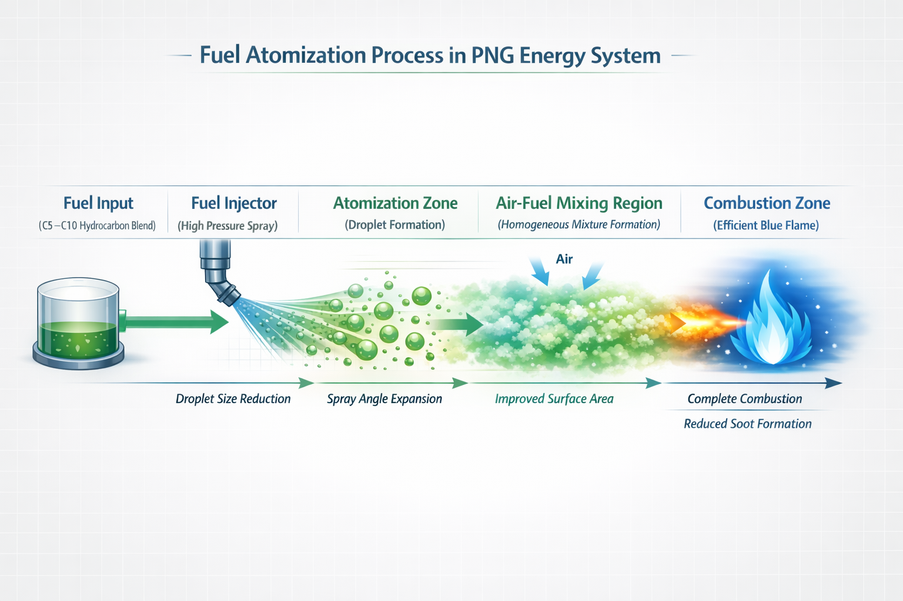

# Fuel Atomization in Internal Combustion Engines  
### and Its Impact on Combustion Efficiency  

---

## 1. Introduction

Fuel atomization is a critical process in internal combustion (IC) engine systems that directly influences combustion efficiency, power output, fuel economy, and emission characteristics.

It refers to the mechanical breakup of liquid fuel into fine droplets prior to or during injection into the combustion chamber.

The quality of atomization governs the effectiveness of air–fuel mixing, which determines combustion completeness and stability. Poor atomization leads to incomplete combustion and higher emissions, while efficient atomization enhances engine performance and environmental sustainability.

---

## 2. Fundamental Principles of Fuel Atomization

Fuel is delivered into the combustion chamber through injectors or carburetors under pressure. As liquid fuel passes through a nozzle, it disintegrates into droplets due to aerodynamic and mechanical forces.

### Key influencing parameters:
- Injection pressure  
- Nozzle geometry and design  
- Fuel viscosity and density  
- Air velocity and in-cylinder turbulence  

Smaller droplets increase the surface-area-to-volume ratio, accelerating evaporation and improving chemical reaction rates during combustion.

---

## 3. Atomization Quality: Poor vs Efficient Spray

### 3.1 Poor Atomization (Coarse Spray)

Characteristics:
- Large droplet size  
- Incomplete air–fuel mixing  
- Uneven combustion zones  
- Increased soot (carbon deposits)  
- Higher fuel consumption  

**Effects:**
- Reduced thermal efficiency  
- Increased emissions (CO, unburned hydrocarbons)  

---

### 3.2 Efficient Atomization (Fine Mist Spray)

Characteristics:
- Fine droplet distribution  
- Uniform air–fuel mixing  
- Rapid and stable combustion  
- Reduced knocking tendency  

**Effects:**
- Higher combustion efficiency  
- Lower emissions  
- Improved engine smoothness  

---
## Figure 3.1: Fuel Atomization Process

Fuel atomization is the process in which liquid fuel is broken into fine droplets at the injector nozzle. This increases the surface area of the fuel, allowing faster evaporation and better mixing with air. The improved air–fuel mixture leads to more efficient combustion, higher engine performance, and reduced emissions.

## 4. Role of Atomization in PNG Fuel Systems

In advanced fuel systems such as **PNG (Pure Natural Gas conceptual systems)**, atomization plays a central role in achieving controlled combustion behavior.

### Key requirements:
- Stable flame propagation  
- Controlled ignition timing  
- Reduced knocking and pre-ignition  
- Efficient energy conversion  

Enhanced atomization acts as a bridge between conventional liquid fuels and cleaner fuel technologies by improving mixing precision and combustion control.

---

## 5. Engineering Factors Affecting Atomization

### Critical variables:

- **Injection Pressure**  
  Higher pressure promotes finer droplet breakup  

- **Injector Design**  
  Multi-hole and advanced nozzle designs improve spray distribution  

- **Air Turbulence**  
  Swirl and tumble motion enhance mixing  

- **Fuel Properties**  
  Viscosity and density influence droplet formation  

- **Temperature Conditions**  
  Affect evaporation rate and vaporization dynamics  

Optimization of these parameters is essential for high-performance combustion systems.

---

## 6. Environmental and Performance Implications

Efficient atomization contributes to:

- Reduced greenhouse gas emissions  
- Lower particulate matter (PM) formation  
- Improved fuel economy  
- Enhanced engine durability  

From an engineering perspective, atomization is a key control parameter in achieving cleaner and more sustainable propulsion systems.

---

## 7. Conclusion

Fuel atomization is a fundamental determinant of combustion quality in internal combustion engines.

The transition from coarse to fine atomization:
- improves efficiency  
- reduces emissions  
- enhances engine performance  

In modern energy systems, especially PNG-based concepts, atomization is not only a mechanical process but a critical design variable in next-generation fuel technologies.

---

## Related Modules (PNG System)

- Combustion Mechanism  
- Fuel Injection Dynamics  
- Thermodynamic Efficiency Models
