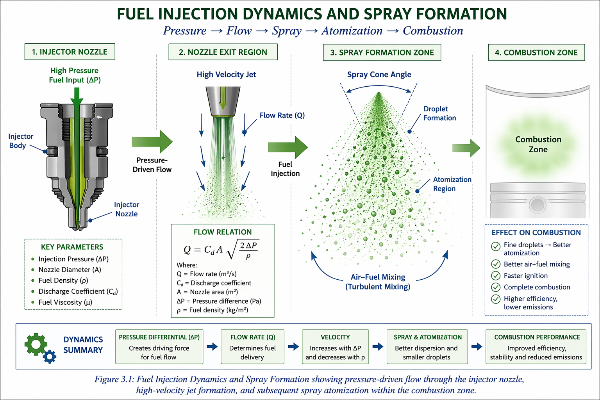

# FUEL INJECTION DYNAMICS 

## 1. INTRODUCTION
Fuel injection dynamics describe the physical and thermodynamic behavior of fuel as it is delivered from an injector into a combustion chamber. In the PNG (Pure Natural Gas) Energy System, this process defines the initial boundary condition for downstream atomization, mixing, ignition, and combustion efficiency.

This model formalizes injection as a time-dependent fluid–energy control system rather than a static flow event.

### Engineering objectives
- Controlled fuel mass delivery  
- Optimized spray formation  
- Improved air–fuel mixing  
- Reduced incomplete combustion losses  

---

## 2. GOVERNING PRINCIPLES OF FUEL INJECTION

### 2.1 Nozzle Flow Dynamics
Fuel discharge is governed by pressure differential across a calibrated orifice.

**Equation:**

Q = C_d A √(2ΔP / ρ)

**Variables:**
- Q = volumetric flow rate (m³/s)
- C_d = discharge coefficient
- A = nozzle area (m²)
- ΔP = pressure difference (Pa)
- ρ = fuel density (kg/m³)

**Interpretation:**
- Higher ΔP → higher jet velocity → better atomization  
- Smaller A → higher velocity but reduced mass flow  

---

### 2.2 Time-Dependent Injection Dynamics
Real injection systems are transient:

Q(t) = C_d A √(2ΔP(t) / ρ)

**Drivers:**
- Injector response time  
- Pressure wave dynamics  
- Valve actuation delay  

Injection behaves as a **dynamic control system**, not a steady flow.

---

### 2.3 Spray Formation Physics
Jet breakup occurs through instability mechanisms:

- Primary breakup → liquid core disintegration  
- Secondary breakup → droplet fragmentation  

**Key dimensionless effects:**
- Reynolds number → turbulence intensity  
- Weber number → surface tension vs aerodynamic force  

**Outputs:**
- Spray penetration length  
- Cone angle  
- Droplet size distribution  
—
## Figure 2.1 – Fuel Injection Flow and Spray Formation

**This figure illustrates:**

The transition of fuel from a high-pressure liquid jet at the injector nozzle into a dispersed multiphase spray within the combustion chamber, highlighting jet breakup, droplet formation, and spray cone development.

**Engineering significance:**
- Pressure energy → kinetic jet energy  
- Jet instability → atomization  
- Spray geometry → mixing efficiency  

**System role in PNG architecture:**
Injection → Spray Formation → Air–Fuel Mixing → Ignition → Combustion → Energy Output  
---

### Description
This figure illustrates the transition of fuel from a high-pressure liquid jet at the injector nozzle into a dispersed multiphase spray structure inside the combustion chamber.

### Components shown
- Injector nozzle under high-pressure supply (ΔP)
- High-velocity fuel jet exiting orifice
- Primary breakup zone (continuous jet → ligaments)
- Secondary breakup zone (droplet formation)
- Spray cone development
- Atomization field inside the combustion chamber

### Engineering significance
This figure represents the fundamental physical transition in fuel injection dynamics, where:
- Pressure energy is converted into kinetic jet energy
- Jet instability leads to atomization
- Spray geometry determines air–fuel mixing efficiency

### System role in PNG Energy Architecture
Injection → Spray Formation → Air–Fuel Mixing → Ignition → Combustion → Energy Output
## 3. INJECTION SYSTEM CONTROL PARAMETERS

### 3.1 Injection Pressure (ΔP)
- Higher pressure → finer droplets  
- Higher pressure → better mixing  
- Higher pressure → stable combustion  

---

### 3.2 Nozzle Geometry
- Orifice diameter  
- L/D ratio  
- Hole orientation  

Controls spray angle and mixing zone formation.

---

### 3.3 Fuel Properties
- Density (ρ)  
- Viscosity (μ)  

Effects:
- Higher viscosity → larger droplets  
- Higher density → higher jet momentum  

---

### 3.4 Thermal Conditions
- High temperature → improved vaporization  
- Low temperature → liquid persistence  

---

### 3.5 Injection Timing (SOI / DOI / EOI)
- SOI = Start of Injection  
- DOI = Duration of Injection  
- EOI = End of Injection  

Controls:
- Combustion phasing  
- Ignition delay  
- Peak pressure timing  

---

## 4. NUMERICAL ANALYSIS

Given:
- C_d = 0.85  
- A = 1.5 × 10⁻⁶ m²  
- ΔP = 3 × 10⁶ Pa  
- ρ = 750 kg/m³  

**Calculation:**

Q = C_d A √(2ΔP / ρ)

Q ≈ 1.14 × 10⁻⁴ m³/s

### 4.1 Interpretation
- Q ≈ 0.114 L/s  
- High-velocity injection regime  
- Supports fine atomization  

---

## 5. COMBUSTION SYSTEM ARCHITECTURE

Injection → Spray Formation → Air–Fuel Mixing → Ignition Kernel Formation → Flame Propagation → Energy Output

### Functional mapping
- Injection → momentum input  
- Spray → spatial distribution  
- Mixing → equivalence ratio control  
- Ignition → combustion start  
- Flame → energy release rate  

---

## 6. ENGINEERING APPLICATIONS
- Internal combustion engines (SI / CI)  
- Gas energy systems  
- Hybrid PNG catalytic systems  
- Injection research platforms  

---

## 7. OPTIMIZATION FRAMEWORK

### Variables
- ΔP (pressure)  
- A (geometry)  
- SOI / DOI / EOI  
- Fuel properties  

### Objective
Maximize combustion efficiency (ηc)

### Constraints
- Stable ignition  
- Low emissions  
- Controlled pressure rise  

---

## 8. SYSTEM INTEGRATION (PNG ARCHITECTURE)

- Fuel Atomization Module  
- Catalyst Process Module  
- Combustion Output Module  

Role:
- Defines boundary condition  
- Controls reaction efficiency  
- Stabilizes system output  

---

## 9. CONCLUSION
Fuel injection dynamics define the foundational control layer of the PNG Energy System. Performance is governed by pressure, geometry, timing, and fuel properties.

